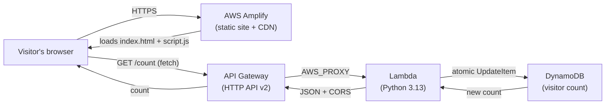

# Cloud Resume — Serverless Site on AWS (Terraform)

A personal resume site with a live visitor counter, built entirely as a serverless application on AWS and provisioned with **Terraform**. The backend, tests, and CI/CD pipeline are all defined as code.

**Live demo:** https://main.dhe8lv71dyvbt.amplifyapp.com

Based on the [Cloud Resume Challenge](https://cloudresumechallenge.dev/), implemented with Terraform instead of SAM.

---

## Architecture



When someone opens the page, their browser loads the static site from Amplify over HTTPS. The page's JavaScript calls a public API Gateway endpoint, which triggers a Lambda function. The function atomically increments a counter in DynamoDB and returns the new value, which is displayed in the page footer.

---

## Tech stack

| Layer | Technology |
|---|---|
| Frontend | HTML / CSS / JavaScript |
| Hosting | AWS Amplify (managed HTTPS, CDN, and auto-deploy) |
| API | API Gateway (HTTP API v2) |
| Compute | AWS Lambda (Python 3.13) |
| Database | DynamoDB (on-demand / PAY_PER_REQUEST) |
| Infrastructure as Code | Terraform (AWS provider `~> 6.0`) |
| Tests | pytest + moto |
| CI/CD | GitHub Actions (OIDC auth, no stored secrets) |
| Region | `us-east-2` (Ohio) |

---

## Repository structure

```
cloud-resume-terraform/
├── provider.tf              # Terraform + AWS provider config
├── dynamodb.tf              # DynamoDB visitor-count table
├── dynamodb_seed.tf         # Seed item (initial count = 0)
├── lambda.tf                # Lambda function + least-privilege IAM role
├── apigateway.tf            # HTTP API, route, integration, permissions
├── github_oidc.tf           # OIDC role for GitHub Actions (terraform plan)
├── lambda/
│   ├── visitor_count.py     # Lambda handler (increments and returns count)
│   └── test_visitor_count.py# pytest unit tests (mocked with moto)
├── website/
│   ├── index.html           # Resume content
│   ├── styles.css           # Styling
│   └── script.js            # Fetches the count from the API
└── .github/workflows/
    └── ci.yml               # CI pipeline: test → terraform plan
```

---

## How it works

### Backend (all in Terraform)

- **DynamoDB** stores a single item (`id = visitor_count`) holding the running count. The table uses on-demand billing, so there's no capacity to manage and cost is effectively zero at this scale.
- **Lambda** performs an **atomic** `UpdateItem` with an `ADD` expression, so the read-increment-write happens server-side in one operation. Even simultaneous visitors can't clobber each other's updates.
- **API Gateway (HTTP API v2)** exposes the Lambda as a public `GET /count` endpoint with CORS configured, so the browser can call it directly.

### Security

- The Lambda's IAM role follows **least privilege**: it can only perform `UpdateItem` and `GetItem` on this one specific table — not `dynamodb:*`, not all tables.
- CI/CD authenticates to AWS using **GitHub OIDC** — GitHub receives short-lived credentials per run, with **no long-lived access keys stored** anywhere. The trust policy is scoped so that *only this repository* can assume the role.
- The CI role is granted **read-only** access, so the pipeline can run `terraform plan` but is technically incapable of changing infrastructure.

### CI/CD

**Frontend:** Amplify is connected to this repo and automatically rebuilds and redeploys the site on every push to `main`.

**Backend:** A GitHub Actions workflow runs on every push:

1. **Test** — installs dependencies and runs the pytest suite.
2. **Plan** — *only if tests pass*, authenticates via OIDC and runs `terraform plan`.

Terraform changes are surfaced as a plan for human review rather than auto-applied, which is the safer pattern for infrastructure.

---

## Running it yourself

### Prerequisites

- [Terraform](https://developer.hashicorp.com/terraform/install) `>= 1.5`
- [AWS CLI](https://docs.aws.amazon.com/cli/latest/userguide/getting-started-install.html) configured with credentials (`aws configure`)
- Python 3.13 (for running tests locally)

### Deploy the backend

```bash
terraform init
terraform plan
terraform apply
```

After apply, Terraform outputs the public API URL:

```bash
terraform output api_url
```

### Run the tests

```bash
cd lambda
pip install pytest boto3 moto
python -m pytest test_visitor_count.py -v
```

The tests use `moto` to mock DynamoDB in memory, so they run instantly without touching real AWS resources.

### Frontend

The site in `website/` is deployed via AWS Amplify (connected to this GitHub repo). Update the `API_URL` in `website/script.js` to your own API endpoint if deploying independently.

---

## Design decisions & highlights

- **Terraform over SAM** — chosen to demonstrate a cloud-agnostic IaC tool that's widely requested in DevOps roles.
- **Atomic counter** — using DynamoDB's `ADD` update expression avoids race conditions without locking.
- **OIDC federation** — no static AWS keys in GitHub; credentials are minted per-run and scoped to this repo.
- **Managed frontend hosting** — Amplify provides HTTPS, a CDN, and continuous deployment out of the box, keeping the frontend pipeline simple.
- **Test-gated pipeline** — infrastructure planning only runs after unit tests pass.

---

## Possible future improvements

- Move Terraform state to a remote **S3 backend** with DynamoDB state locking (currently local).
- Add a `lifecycle { ignore_changes }` on the seed item so Terraform doesn't try to reset the live counter on each plan.
- Add a custom domain with Route 53 + CloudFront/ACM.
- Extend CI to a gated `terraform apply` on approved changes.

---

## Author

**Rezwana Ashrafi** — Cloud / DevOps Engineer, AWS Certified Solutions Architect (SAA-C03)
Greater Vancouver, BC

- GitHub: [@Rezwanaasharfi](https://github.com/Rezwanaasharfi)
- LinkedIn: [rezwana-ashrafi](https://www.linkedin.com/in/rezwana-ashrafi)
